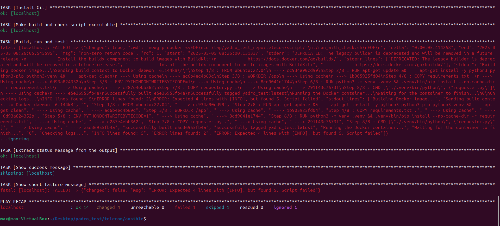

### Телеком. Тестовое задание

#### 1. Работа со скриптом

В соответствии с требованиями, был написан python скрипт [`/script/requester.py`](./script/requester.py).
Скрипт обращается к каждому из 5 разных заранее заготовленных эндпойнтов с адресами, 
и в соответствии с заданием - либо делает вывод в консоль, либо
выбрасывает исключение (исключение затем перехватывается, и его
содержание также выводится в консоль)

```python
import requests

status_codes = [101, 200, 306, 404, 500]

print('[INFO] Requester app started successfully')
for code in status_codes:
    url = f"https://httpstat.us/{code}"
    try:
        response = requests.get(url)
        if 100 <= response.status_code < 400:
            print(f"[INFO] Status: {response.status_code}, Body: {response.text.strip()}")
        else:
            raise Exception(f"[ERROR] Status: {response.status_code}, Body: {response.text.strip()}")
    except Exception as e:
        print(e)
print('[INFO] Requester app is shutting down')
```

#### 2. Работа с Docker

Далее, для развёртывания скрипта в докер-контейнере был
написан докерфал [`/docker/Dockerfile`](./docker/Dockerfile) (или [`/script/Dockerfile`](./script/Dockerfile) - они 
идентичны). 

Докерфайл устанавливает нужные apt пакеты (с последующей очисткой кэша),
переносит из папки [`/script`](./script) файл с зависимостями скрипта, запрещает
python кэшировать байткод (для уменьшения размера образа), устанавливает
зависимости скрипта в виртуальное окружение и запускает сам скрипт

```dockerfile
FROM ubuntu:22.04
RUN apt-get update && \
    apt-get install -y python3 python3-pip python3-venv && \
    apt-get clean

WORKDIR /app

COPY requirements.txt .
ENV PYTHONDONTWRITEBYTECODE=1

RUN python3 -m venv .venv && .venv/bin/pip install --no-cache-dir -r requirements.txt

COPY requester.py .

CMD ["./.venv/bin/python", "requester.py"]
```

Для того, чтобы проверять скрипт на корректность с помощью `docker logs`,
был написан внешний `sh`-скрипт ([`/script/run_with_check.sh`](./script/run_with_check.sh)), который также собирает образ и
запускает на его основе контейнер

```shell
#!/bin/bash

image_name="yadro_test:latest"

echo "Building Docker image..."
docker build . -t $image_name

echo "Running the Docker container..."
container_id=$(docker run -d $image_name)

echo "Waiting for the container to finish..."
docker wait "$container_id"

echo "Checking logs..."
logs=$(docker logs $container_id)

info_count=$(echo "$logs" | grep -c '\[INFO\]')
error_count=$(echo "$logs" | grep -c '\[ERROR\]')

echo "INFO lines found: $info_count"
echo "ERROR lines found: $error_count"

if [[ "$info_count" -ne 5 ]]; then
  echo "ERROR: Expected 5 lines with [INFO], but found $info_count. Script failed"
  exit 1
fi

if [[ "$error_count" -ne 2 ]]; then
  echo "ERROR: Expected 2 lines with [ERROR], but found $error_count. Script failed"
  exit 1
fi

echo "Script worked correctly!"
exit 0

```

#### 3. Автоматизация процесса с помощью Ansible

И наконец, был написан `Ansible` код (директория [`/ansible`](./ansible)), состоящий
из:
- [`inventory.yml`](./ansible/inventory.yml)
- [`playbook.yml`](./ansible/playbook.yml)
- [`secrets.yml`](./ansible/secrets.yml)

Плейбук запускается такой командой:

`ansible-playbook -i inventory.yml playbook.yml --ask-vault-pass`

В `secrets.yml` хранится рут-пароль от локалхоста.

Хосты указаны в `inventory.yml`

```yaml
all:
  hosts:
    localhost:
       ansible_connection: local
       ansible_become_pass: "{{ localhost_become_pass }}"
```

А сам плейбук состоит из двух плеев. Первый - отвечает за установку докера.
Второй - за копирование кода из репозитория, его сборку и запуск.

```yaml
- name: Install Docker
  hosts: localhost
  become: true
  vars_files:
    - secrets.yml
  tasks:
    - name: Update APT cache
      ansible.builtin.apt:
        update_cache: yes

    - name: Install Docker package
      ansible.builtin.apt:
        name: docker.io
        state: present

    - name: Get current user
      ansible.builtin.command: whoami
      register: current_user
      changed_when: false

    - name: Add user to Docker group
      ansible.builtin.user:
        name: "{{ current_user.stdout }}"
        group: docker
        append: yes

    - name: Restart Docker service to apply group changes
      ansible.builtin.systemd:
        name: docker
        state: restarted
        enabled: yes

    - name: Check Docker installation
      ansible.builtin.command: docker --version
      register: docker_version

    - name: Output Docker version
      debug:
        msg: "Docker is installed and has version {{ docker_version.stdout }}"

    - name: Enable Docker service
      ansible.builtin.systemd:
        name: docker
        enabled: yes
        state: started

- name: Download and build Docker image
  hosts: localhost
  vars_files:
    - secrets.yml
  tasks:
    - name: Install Git
      become: true
      ansible.builtin.apt:
        name: git
        state: present

    - name: Clone repo
      ansible.builtin.git:
        repo: "https://github.com/EliteHacker228/yadro_test"
        dest: "/tmp/yadro_test_repo"
        version: "main"
        force: yes

    - name: Make build and check script executable
      become: true
      ansible.builtin.file:
        path: /tmp/yadro_test_repo/telecom/script/run_with_check.sh
        mode: "755"

    - name: Build, run and test
      ansible.builtin.shell: |
        newgrp docker <<EOF
        cd /tmp/yadro_test_repo/telecom/script/ 
        ./run_with_check.sh
        EOF
      register: build_test_result
      ignore_errors: yes

    - name: Output result of build and test script and handle exit code
      block:
      - name: Extract status message from the output
        ansible.builtin.shell: |
          echo "{{ build_test_result.stdout }}" | tail -n 1
        register: last_line
        changed_when: false 

      - name: Show success message
        debug:
          msg: "{{ last_line.stdout }}"
        when: build_test_result.rc == 0

      - name: Show short failure message
        fail:
          msg: "{{ last_line.stdout }}"
        when: build_test_result.rc != 0
```

Скриншоты с примером запуска плейбука:

Проверка успешна


Проверка провалена (для достижения эффекта были изменены параметры числа строк из скрипты на недостигаемые)


